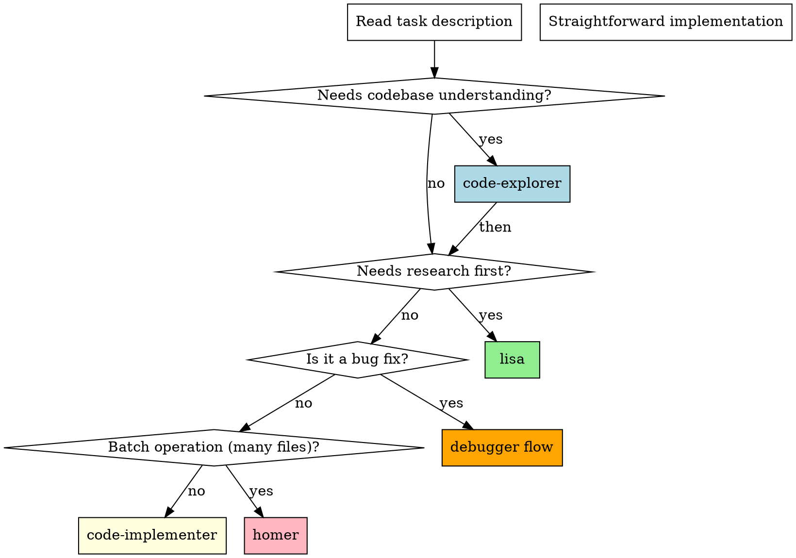
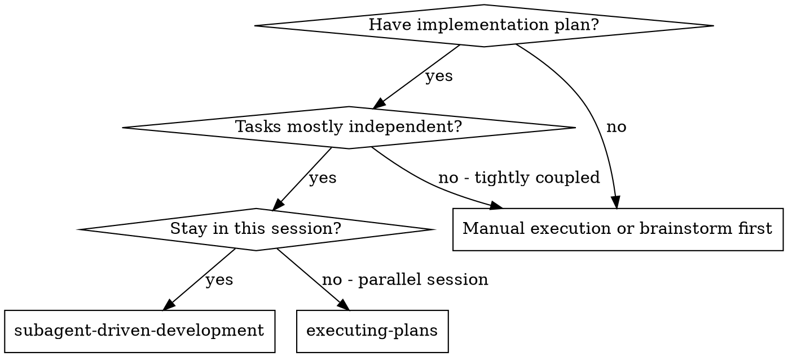
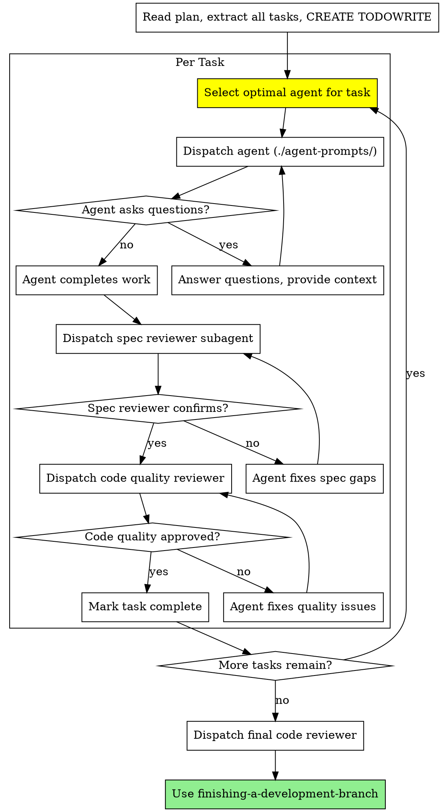

# Subagent-Driven Development

Execute plan by dispatching the **optimal agent per task**, with two-stage review after each: spec compliance review first, then code quality review.

**Core principle:** Right agent per task + two-stage review = high quality, fast iteration

## Agent Selection (MANDATORY)

Before dispatching ANY task, determine the optimal agent:

```
┌─────────────────────────────────────────────────────────────┐
│                 AGENT SELECTION MATRIX                      │
├─────────────────────────────────────────────────────────────┤
│                                                             │
│  Task involves...              → Use agent...               │
│  ─────────────────────────────────────────────────────────  │
│  Understanding existing code   → code-explorer (first)      │
│  Research before building      → lisa                       │
│  Straightforward implementation→ code-implementer           │
│  Debugging / fixing bugs       → code-explorer + debug      │
│  Batch changes (many files)    → homer                      │
│  Stuck / same error repeatedly → bart                       │
│  Safety / security review      → marge                      │
│  Full PRD autonomous execution → ralph                      │
│                                                             │
└─────────────────────────────────────────────────────────────┘
```

### Decision Flow Per Task



### Agent Selection Keywords

| Keywords in Task | Agent | Rationale |
|------------------|-------|-----------|
| "explore", "understand", "trace", "find where", "how does" | `code-explorer` | Read-only investigation |
| "research", "investigate", "analyze first", "best approach" | `lisa` | Research before implementation |
| "implement", "create", "add", "build", "write" | `code-implementer` | Standard implementation |
| "fix bug", "debug", "error", "not working", "broken" | `code-explorer` → `code-implementer` | Understand first, then fix |
| "all files", "batch", "refactor everywhere", "100+", "massive" | `homer` | Parallel batch processing |
| "stuck", "tried everything", "same error", "alternative" | `bart` | Creative pivot needed |
| "security", "safety check", "before deploy", "review risk" | `marge` | Safety guardian |
| "autonomous", "complete PRD", "all tasks", "loop until done" | `ralph` | Persistent loop |

### Chained Agents

Some tasks require multiple agents in sequence:

```
Pattern 1: Explore → Implement
  Task: "Add caching to the user service"
  Flow: code-explorer (understand current service) → code-implementer (add caching)

Pattern 2: Research → Implement
  Task: "Integrate Stripe payments"
  Flow: lisa (research Stripe patterns, check existing code) → code-implementer

Pattern 3: Debug → Fix
  Task: "Fix the login timeout issue"
  Flow: code-explorer (trace the flow) → understand root cause → code-implementer (fix)

Pattern 4: Explore → Batch
  Task: "Update all components to new Button API"
  Flow: code-explorer (find all usages) → homer (batch update)
```

## When to Use This Skill



## The Process



## Prompt Templates

| Agent | Prompt Template |
|-------|-----------------|
| `code-explorer` | `./agent-prompts/explorer-prompt.md` |
| `lisa` | `./agent-prompts/lisa-prompt.md` |
| `code-implementer` | `./implementer-prompt.md` |
| `homer` | `./agent-prompts/homer-prompt.md` |
| `bart` | `./agent-prompts/bart-prompt.md` |
| Spec reviewer | `./spec-reviewer-prompt.md` |
| Code quality reviewer | `./code-quality-reviewer-prompt.md` |

## TodoWrite Format

When creating the todo list, include the selected agent:

```
# Todos
[•] Task 1: Toast Component | AGENT: code-implementer | METHOD: TDD
[ ] Task 2: Research Stripe API | AGENT: lisa | METHOD: Research-first
[ ] Task 3: Find all Button usages | AGENT: code-explorer | METHOD: Investigation
[ ] Task 4: Update all Buttons | AGENT: homer | METHOD: Batch refactor
[ ] Task 5: Fix auth timeout | AGENT: code-explorer → code-implementer | METHOD: Debug + fix
```

## Example Workflow

```
You: I'm using Subagent-Driven Development to execute this plan.

[Read plan file]
[Analyze each task, select optimal agent]
[Create TodoWrite with agent assignments]

# Todos
[•] Task 1: Research payment patterns | AGENT: lisa
[ ] Task 2: Implement PaymentService | AGENT: code-implementer
[ ] Task 3: Fix race condition in checkout | AGENT: code-explorer → code-implementer
[ ] Task 4: Update all price displays | AGENT: homer

--- Task 1: Research payment patterns ---
Agent: lisa (research-first)

[Dispatch lisa with research task]
Lisa: "Researched existing payment code, found PaymentGateway interface,
      recommend implementing StripeGateway following existing pattern..."

[Dispatch spec reviewer]
Spec reviewer: ✅ Research complete, recommendations align with task

[Mark Task 1 complete]

--- Task 2: Implement PaymentService ---
Agent: code-implementer (lisa already did research)

[Dispatch code-implementer with implementation task + lisa's research]
Implementer: "Implemented StripeGateway following PaymentGateway interface,
             added tests, 12/12 passing, committed"

[Dispatch spec reviewer]
Spec reviewer: ✅ Spec compliant

[Dispatch code quality reviewer]
Code reviewer: ✅ Approved

[Mark Task 2 complete]

--- Task 3: Fix race condition ---
Agent: code-explorer first (understand the issue)

[Dispatch code-explorer to trace checkout flow]
Explorer: "Found race condition: checkout() and inventory.reserve()
          can interleave. Lock needed at line 45 of checkout.ts"

[Now dispatch code-implementer with explorer's findings]
Implementer: "Added mutex lock, wrote regression test, verified fix"

[Reviews...]
[Mark Task 3 complete]

--- Task 4: Update all price displays ---
Agent: homer (batch operation)

[Dispatch homer for batch update]
Homer: "Found 47 price display components, updated all to new format,
       all tests passing, committed"

[Reviews...]
[Mark Task 4 complete]

[Dispatch final code reviewer]
[Use finishing-a-development-branch]

Done!
```

## Red Flags

**Always:**
- Select the RIGHT agent for each task (don't default to code-implementer)
- Use code-explorer BEFORE implementation when understanding is needed
- Use lisa for tasks requiring research or investigation
- Use homer for batch operations across many files
- Chain agents when task requires multiple phases
- Run both reviews (spec compliance and code quality)
- Keep todo list updated with agent assignments

**If task seems complex:**
- Break it into phases with different agents
- Explorer first to understand, then implementer to build

**If agent gets stuck:**
- Switch to bart for creative pivot
- Don't keep retrying with the same agent

**If fixing a bug:**
- ALWAYS use code-explorer first to understand root cause
- Then code-implementer to fix (with root cause knowledge)

## Integration

**MANDATORY before dispatching:**
- **superpowers:slice-agent-harness** - Apply SLICE methodology to every task dispatch

**Required workflow skills:**
- **superpowers:writing-plans** - Creates the plan this skill executes
- **superpowers:requesting-code-review** - Code review template for reviewer subagents
- **superpowers:finishing-a-development-branch** - Complete development after all tasks

**Agents should use:**
- **superpowers:test-driven-development** - For implementation tasks
- **superpowers:systematic-debugging** - For bug fix tasks

**Alternative workflow:**
- **superpowers:executing-plans** - Use for parallel session instead of same-session execution
